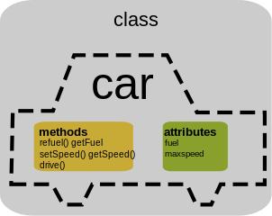
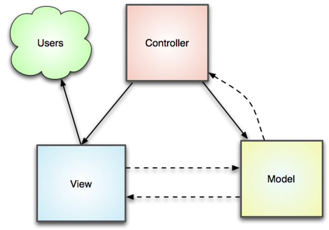

<h2 class="orange-text">WEB DEVELOPER</h2>
<h2 class="orange-text">IN 2019</h2>
<small class="text-muted">TIME TO DECIDE WHICH SIDE YOU'RE ON</small>

<!-- ### A GitPitch Presentation Template -->

---
<div class="left">

</div>
<div class="right">
<br />
<br />
<h4 class="text-info">Muhammad Raihan Nismara Jendra</h4>
<small class="text-muted"><i class="fa fa-smile-o"></i> Web Developer</small><br />
<small class="text-muted"><i class="fa fa-building-o"></i> Belanjaqu</small><br />
<small class="text-muted"><i class="fa fa-globe"></i> raihan71.github.io</small>
</div>

---


## FRONT END DEVELOPER

---
<!-- .slide: data-background-image="./assets/roadmap-fe.png" data-background-color="#fff" data-background-size="auto 95%" data-background-position="center" data-background-repeat=" " data-background-transition="none" -->

---
## FRONT END - SECTION

- Introduction  <!-- .element: class="fragment" -->
- Learn the basic  <!-- .element: class="fragment" -->
- Getting deeper  <!-- .element: class="fragment" -->
- Choose framework  <!-- .element: class="fragment" -->
- Live Coding  <!-- .element: class="fragment" -->

---
## INTRODUCTION
<small>Overview Front-End</small> <!-- .element: class="fragment" -->
---

<!-- .slide: data-background-image="./assets/fb.jpg" data-background="#3d5d9a" data-background-size="auto 95%" data-background-position="center" data-background-repeat=" " data-background-transition="none" --> <!-- .element: class="fragment" -->

---

<!-- .slide: data-background-image="./assets/ig.jpg" data-background="#ab368e" data-background-size="auto 95%" data-background-position="center" data-background-repeat=" " data-background-transition="none" --> <!-- .element: class="fragment" -->

---
<p class="text-justify">Front-end web development adalah metode untuk mengonversikan data ke dalam antarmuka pengguna atau tampilan suatu aplikasi/website. Sehingga, pengguna dapat berinteraksi dengan data melalui interaksi visual & digital.</p>
---
<div class="left">

</div>
<div class="right">

</div>
<br />
<h3>Front End Developer</h3><!-- .element: class="fragment" -->
---
## LEARN THE BASIC
<small>HTML,CSS,JS</small> <!-- .element: class="fragment" -->
---
  <table class="table table-bordered table-hover table-striped bg-info">
    <thead>
      <tr>
        <th colspan="3" align="center">FRONT-END</th>
      </tr>
    </thead>
    <tbody>
      <tr>
        <td align="center">HTML</td>
        <td align="center">CSS</td>
        <td align="center">JS</td>
      </tr>
    </tbody>
  </table>
---
<span class='menu-title slide-title'>HTML Syntax</span>
```html
<!DOCTYPE html>
<html>
<head>
  <title>Web Developer</title>
</head>
<body>

</body>
</html>

```
---
<span class='menu-title slide-title'>CSS Syntax</span>
```css
<style>
  small {
    color: orange;
    font-size: 10px;
  }
</style>
```

<div class="left text-info">
<p>small = selector</p> <!-- .element: class="fragment" -->
</div>
<div class="right" style="color:grey">
<p>{ } = declaration</p> <!-- .element: class="fragment" -->
</div>
<div class="left" style="color:purple">
<p>color = property</p> <!-- .element: class="fragment" -->
</div>
<div class="right text-danger">
<p>orange = value</p> <!-- .element: class="fragment" -->
</div>

---
<span class='menu-title slide-title'>JS Syntax</span>
```
<script>
  var x, y, z;         // Cara deklarasi variable
  x = 10; y = 20;   // Cara memberikan nilai/value
  z = x + y;        // Cara menghitung nilai/value

  alert(z);   // Menampilkan hasil
</script>

```
<div class="left text-info">
<p>alert</p> <!-- .element: class="fragment" -->
</div>
<div class="right" style="color:grey">
<p>console.log</p> <!-- .element: class="fragment" -->
</div>
---
<span class='menu-title slide-title'>Full Syntax</span>
```
<!DOCTYPE html>
<html>
<head>
  <title>Web Developer</title>
  <style>
    small {
      color: orange;
      font-size: 10px;
    }
  </style>
</head>
<body>
  <small>Hello World</small> -Ray

  <script>
    var x, y;         // Cara deklarasi variable
    x = 10; y = 20;   // Cara memberikan nilai/value
    z = x + y;        // Cara menghitung nilai/value

    alert(z);         // Menampilkan hasil
  </script>
</body>
</html>
```
---
## Getting Deeper
<small>With Front-End</small> <!-- .element: class="fragment" -->
---
### TOOLS
<div class="left">
  
</div>
<div class="right">
  
</div>
<div class="left">
  
</div>
<div class="right">
  
</div>
---
## Technique
### Css Internal Style
```
<!DOCTYPE html>
<html>
<head>
  <title>Technique Css</title>
  <style>
    small {
      color: orange;
    }
  </style>
</head>
<body>

</body>
</html>
```
---
### Css Inline Style
```
<body>
  <small style="color: orange;">Hello World</small>
</body>
```
---
### Css External Style
<small>index.html</small>
```
<!DOCTYPE html>
<html>
<head>
  <title>Technique Css</title>
  <link rel="stylesheet" type="text/css" href="small.css">
</head>
```
<small>small.css</small>
```
small {
    color: orange;
}
```
---
## Programming paradigm

---
<p class="text-justify">Programming paradigm adalah suatu cara untuk mengklasifikasikan bahasa pemrograman berdasarkan tujuan, keutamaan/fitur software yang akan dibuat.</p>
  <p>Contoh :</p> <!-- .element: class="fragment" -->
- Functional Programming<!-- .element: class="fragment" -->
- Object-oriented Programming<!-- .element: class="fragment" -->
- Procedural Programming<!-- .element: class="fragment" -->
- Imperative Programming,dsb.<!-- .element: class="fragment" -->
---
### Object-oriented Programming (OOP)
---
<div class="left">
<p class="text-justify">OOP yaitu suatu metode/paradigma pemrograman yang berorientasi kepada objek. Tujuannya untuk mempermudah pengembangan suatu program/aplikasi dengan mengikuti model yang telah ada di kehidupan sehari-hari.</p>
</div>
<br />
<br />
<br />
<div class="right">
  <!-- .element: class="fragment" -->
</div>
---
## Architectural pattern
---
<p class="text-justify">
  <i>Architectural pattern</i> adalah solusi untuk menyelesaikan masalah yang sering terjadi dalam <i>software architecture</i> ketika akan atau sedang mengembangkan suatu aplikasi/program.
</p>
<p>Contoh :</p> <!-- .element: class="fragment" -->
- Naked objects <!-- .element: class="fragment" -->
- Microservices <!-- .element: class="fragment" -->
- MVC <!-- .element: class="fragment" -->
- MVP <!-- .element: class="fragment" -->
- MVVM <!-- .element: class="fragment" -->
---
### Model-view-controller (MVC)
<p><i>Model-view-controller</i> adalah sebuah metode untuk membuat/membangun sebuah aplikasi dengan memisahkan antar data <i>(Model)</i> dari tampilan <i>(View)</i> dengan bagaimana pemrosesan <i>(Controller)</i> aplikasi itu sendiri.</p> <!-- .element: class="fragment" -->
---

---
## Framework
---
<p class="text-justify">Framework adalah sebuah kerangka aplikasi untuk memudahkan para programer untuk membuat sebuah aplikasi yang di dalam nya ada berbagai fungsi diantaranya plugin, dan konsep untuk membentuk suatu sistem tertentu agar tersusun dan tersetruktur dengan rapi.</p>
---
<table class="table  table-bordered table-hover">
  <thead>
    <tr>
      <th class="bg-primary" align="center" colspan="4">FRONT-END FRAMEWORKS</th>
    </tr>
    <tbody>
      <tr>
        <td class="bg-info" align="center">CSS</td>
        <td align="center"></td>
        <td align="center"></td>
        <td align="center"></td>
      </tr>
      <tr>
        <td class="bg-info" align="center">JS</td>
        <td align="center"></td>
        <td align="center"></td>
        <td align="center"></td>
      </tr>
    </tbody>
  </thead>
</table>
---
<small>Thank You</small><br />
<a href="https://madewithvuejs.com/games" target="_new"> Created with Vuejs</a>
<p>
  <a href="https://experiments.withgoogle.com/collection/chrome" target="_new"> Created by Google based web</a>
</p>